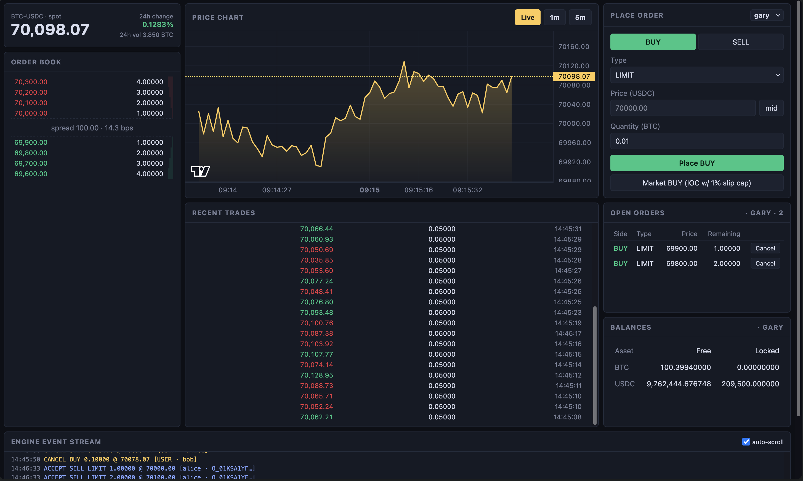
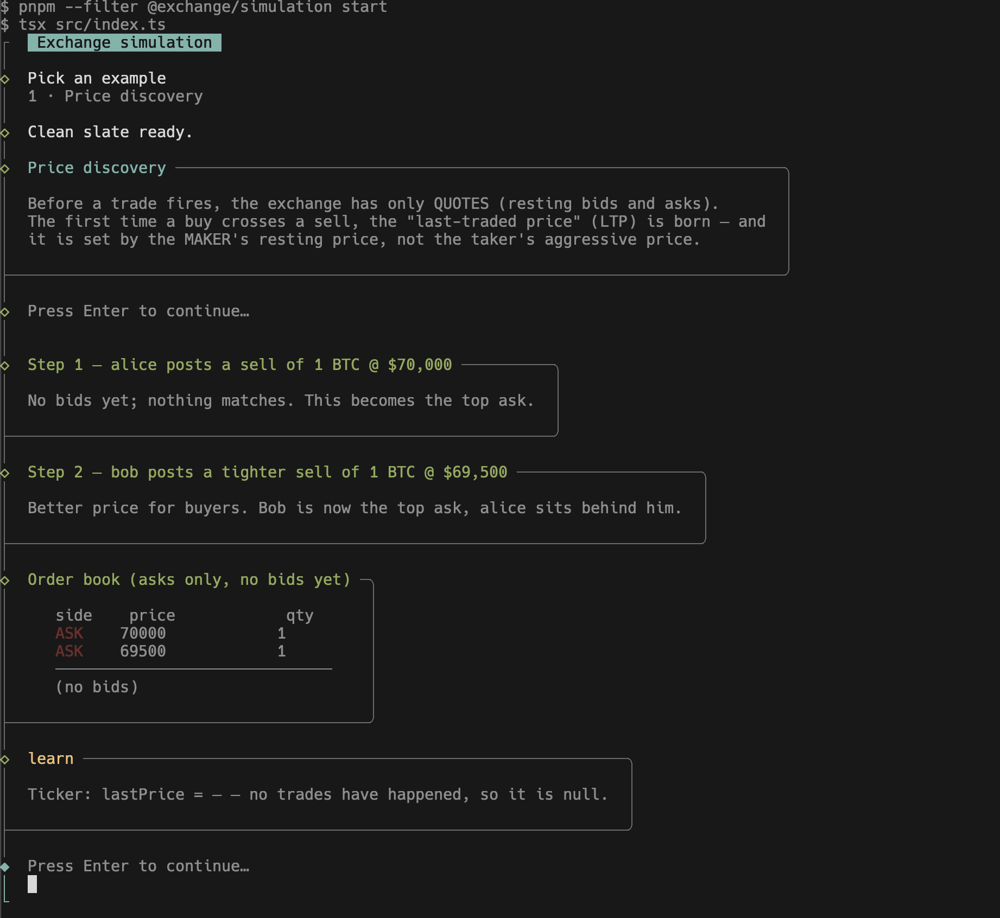
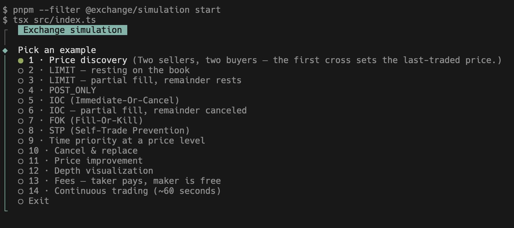

# exchange-ts

A simple crypto exchange built from first principles: a deterministic matching engine, an event-sourced ledger, market-data projections, a React UI for viewing and interacting with the book, and a simulation CLI with ~14 narrated examples that walk through how real exchange order books actually work (price discovery, time priority, STP, slippage, fees, order types, and more).

This repo exists to make the inner workings of an exchange understandable end to end, scoped down to spot trading on a single pair (BTC-USDC). The system is split into focused services: a matching engine, a ledger, a market-data projector, an HTTP + WebSocket gateway, and a React UI. They communicate through a single append-only event stream. The project has two halves. One is the exchange itself (the services above). The other is the simulation package, which is not part of the exchange but drives it through narrated example scripts. The full architecture is documented in [ARCHITECTURE.md](docs/ARCHITECTURE.md).

| Core Exchange | Simulation (walk-through examples) |
| -- | -- |
|  |  |
| The live exchange. A UI dashboard for viewing the order book, recent trades, candles, and your balances against a running matching engine. | Scripted CLI examples that drive the exchange through its public APIs to demonstrate one concept at a time. |

If you are new to trading and not yet familiar with terms like order book, bid, ask, or spread, start with [LEARNING.md](docs/LEARNING.md). Once those feel comfortable, run the simulation to see each concept play out against a real matching engine.


### Getting Started

Install [pnpm](https://pnpm.io/installation) and [Docker Desktop](https://www.docker.com/products/docker-desktop) (which ships with the `docker compose` CLI used by this repo).

Run the exchange first. It boots Redis (the event log), the four backend services (engine, ledger, gateway, market-data), and the React UI at `http://localhost:5173`.

```bash
pnpm install # only once

pnpm redis:up
pnpm dev
```

Once the services are up, open a second terminal and run the simulation CLI. It walks through ~14 narrated examples that cover individual order-book concepts. Keep the UI visible while you run them. The book, tape, candles, and balances all update live as each example progresses.

```bash
pnpm simulation
```



Use `pnpm reset` to wipe all in-memory state (orders, trades, candles, balances) and clear the engine event stream.

### TypeScript vs Go backend

The four backend services (engine, ledger, gateway, market-data) come in two interchangeable implementations that speak the same wire format over the same Redis event stream, so the React UI and simulation CLI work against either.

| | TypeScript | Go |
| -- | -- | -- |
| Source | `packages/` | `packages-go/` |
| Run | `pnpm dev` | `pnpm dev:go` |
| Build | `pnpm build` | `pnpm build:go` |

Both commands also start the same React UI (`http://localhost:5173`). Pick one backend at a time — they bind the same ports. The UI and simulation packages are TypeScript only.

### Contributing

I believe the exchange itself is correct as a demonstration. The matching loop, ledger settlement, and market-data projections all behave the way real systems do at this scale. The contribution most likely to be useful is **more simulation examples** under `packages/simulation/src/examples/`, since that is where the project gets the most active use and where new teaching value is easiest to add without touching the core.

That said, if you find a bug in the exchange server or in any example, or you have an idea for a new example, please open an issue or PR and I'll happily review it.

### Motivation

See [docs/MOTIVATION.md](docs/MOTIVATION.md) for the longer story behind why this project exists.

### License

MIT
