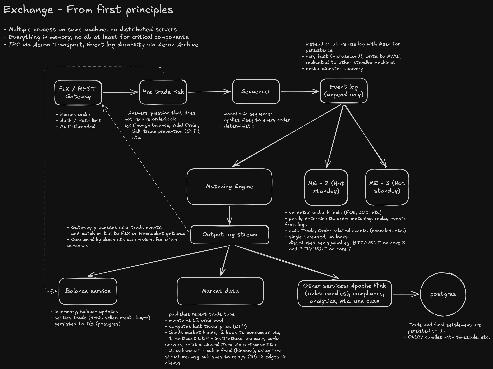

# Architecture

This document describes how the exchange is put together: which services exist, what each one owns, and how they communicate. The goal is to make the design choices visible enough that you can read any single file under `packages/` and know where it fits.

## Overview

The exchange is an event-sourced system. A single-threaded matching engine produces a totally ordered stream of events on a Redis Stream (`engine.events`). Every other service (the ledger, market data, the UI) is a projection of that stream. To rebuild the entire system from cold, only the stream is required.

```
                                ┌──────────────────────────────────────────┐
                                │                                          │
                                │            ┌─────────────────┐           │
   browser ──HTTP/WS──▶  gateway│ ─HTTP──▶   │  engine         │           │
                                │            │  (matcher+book) │ ─XADD──▶  │
                                │            └─────────────────┘           │
                                │                    │                     │
                                │                    │ XADD                │
                                │                    ▼                     │
                                │        ┌─────────────────────────┐       │
                                │        │  Redis Stream           │       │
                                │        │  engine.events          │       │
                                │        └─────────────────────────┘       │
                                │            │            │                │
                                │      XREAD │            │ XREAD          │
                                │            ▼            ▼                │
                                │   ┌─────────────┐  ┌─────────────────┐   │
                                │   │  ledger     │  │  marketdata     │   │
                                │   │  (balances) │  │  (L2/tape/candle│   │
                                │   └─────────────┘  └─────────────────┘   │
                                │                                          │
                                └──────────────────────────────────────────┘
                                              │     pub/sub fanout
                                              ▼
                                    gateway WS ─▶ UI / simulation
```

## Packages

| Package | Role |
| ------- | ---- |
| `packages/common` | Shared types (`Order`, `EngineEvent`), bigint money math (`decimal.ts`), ULID id helpers. No runtime dependencies on other packages in the repo. |
| `packages/engine` | The matching engine and the append-only event log it writes to. Owns the order book and the seq counter. |
| `packages/ledger` | Balance accounting (free and locked) and the Settler, which consumes engine events and turns them into balance mutations. |
| `packages/marketdata` | Read-side projections: L2 book aggregation, trade tape, 1m and 5m candles, ticker. Consumes engine events. |
| `packages/gateway` | The user-facing HTTP and WebSocket entry point. Translates API requests, holds reservations on the ledger before forwarding to the engine, and fans out events to WebSocket clients. |
| `packages/ui` | React + Vite dashboard. Talks to the gateway over HTTP and WS only. |
| `packages/simulation` | A CLI tool with ~14 narrated examples. Not part of the exchange. It drives it through the public API as a learning aid. |

## Event sourcing

The matching engine is the single source of truth. For every order it processes, it produces a contiguous block of events:

- `OrderAccepted` (always first; carries the canonical `Order` record), or
- `OrderRejected` (no further events for that submission),
- followed by zero or more `Trade` events (one per fill),
- optionally terminated by `OrderCanceled` for the same `orderId` with a `reason` of `IOC_REMAINDER`, `STP`, or `MARKET_NO_LIQUIDITY` when the remainder is not allowed to rest.

Standalone `OrderCanceled` events with `reason: USER` are emitted when a user cancels a previously resting order.

Each event has a monotonically increasing `seq`, assigned by the engine at append time. The payload is the JSON-serialized event, with `bigint` fields encoded as decimal strings. See `serializeEvent` in `packages/common/src/events.ts`.

Events are written with `XADD engine.events * data <json>` and simultaneously published on the pub/sub channel `engine.events.live`. The stream is the durable record. The pub/sub fanout is a best-effort low-latency notification for consumers that want to react instantly without holding their own blocking `XREAD` cursor.

## Replay vs. live

Every stateful service has two modes.

In **replay** mode, the service iterates the stream from `0-0` on cold start and rebuilds its in-memory state by applying each event in order. This is bounded. When it reaches the tip of the stream, it switches to **live** mode.

In **live** mode, the service uses `XREAD BLOCK` (or pub/sub fanout, in the gateway) to consume new events as they arrive.

Each service handles this with slightly different rules because the projections are different.

- **Engine** (`packages/engine/src/eventLog.ts`, `replayInto`). Rebuilds the order book. Because the engine itself wrote these events, replay is a near-mirror of the original `submit()` calls: insert the accepted order, apply each trade by reducing the maker at the head of its side, then either rest the remainder (LIMIT, POST_ONLY) or do nothing (terminal cancel, IOC, MARKET).
- **Ledger** (`packages/ledger/src/settler.ts`). Rebuilds balances. In replay mode the settler performs the reservation that the gateway would have done at submission time (because the gateway is not running during cold start). In live mode the gateway is already running and has already reserved, so the settler only handles `Trade` (settle) and `OrderCanceled` (release remainder).
- **Marketdata** (`packages/marketdata/src/streamConsumer.ts`). Rebuilds the L2 aggregation, the recent-trades tape, and the candles by replaying events. A snapshot is published to subscribers when live mode begins.

The replay-or-live distinction is not directly exposed to subscribers. Services do not re-publish to pub/sub during replay (they only mutate in-memory state), so WS clients see a fresh world starting from the moment they subscribe.

## Money math

Money never touches a JS `number`. Everything is `bigint` in base units, defined once in `packages/common/src/decimal.ts`:

| Quantity | Decimals | One whole unit |
| -------- | -------- | -------------- |
| BTC qty  | 8        | `BTC_ONE = 10^8`   (1 BTC = 10^8 satoshi) |
| USDC qty | 6        | `USDC_ONE = 10^6`  (1 USDC = 10^6 micro-USDC) |
| Price (USDC base units per 1 BTC) | 6 | `PRICE_ONE = 10^6` |

`PRICE_DECIMALS` is intentionally set equal to `USDC_DECIMALS`, because price is denominated in USDC. They share a scale, but they are different units. Price is "USDC base units per one whole BTC", USDC qty is just "USDC base units". If USDC had 8 decimals, price would too.

So a price of $67,234.50 per BTC is stored as:

```
67234.50 * 10^6 = 67_234_500_000
```

which means 67,234,500,000 USDC base units per 1 whole BTC.

### Notional

Notional is the total quote-asset (USDC) value of a trade or order at a given price. The helper:

```ts
notionalQuote(price, qtyBase) = (price * qtyBase) / BTC_ONE
```

Trace the units:

- `price` has units of `USDC_base_units / 1 BTC`
- `qtyBase` has units of `BTC_base_units` (satoshis)
- `price * qtyBase` therefore has units of `(USDC_base_units * BTC_base_units) / 1 BTC`
- dividing by `BTC_ONE` (which has units of `BTC_base_units / 1 BTC`) cancels the BTC scaling, leaving `USDC_base_units`.

Worked example, buying 0.5 BTC at $70,000:

```
price    = 70_000 * 10^6 = 70_000_000_000
qty      = 0.5    * 10^8 =     50_000_000
notional = 70_000_000_000 * 50_000_000 / 10^8
         = 35_000_000_000   USDC base units
         = $35,000          ✓
```

Without the `/ BTC_ONE` the result would be off by a factor of 10^8.

### Rounding and the wire format

The matching engine, the settler, and the gateway all use the same math. Rounding is always toward zero (floor); the engine and the settler never invent value. Decimal strings cross the wire (HTTP, WS) and are parsed into bigints at the boundary, using `toBaseUnits` and `fromBaseUnits` in `decimal.ts`.

## Order lifecycle

A `POST /api/orders` to the gateway runs through this sequence. See `packages/gateway/src/server.ts`.

1. Resolve the user from the `X-API-Key` header.
2. Parse the price (if any) and qty into bigints.
3. Compute the reservation. For a buy it is USDC `(price * qty) / BTC_ONE`. For a sell it is BTC `qty`.
4. `POST /reserve` on the ledger. If the user has insufficient free balance, return `402 INSUFFICIENT_FUNDS`.
5. `POST /orders` on the engine. The engine assigns a ULID `orderId`, runs the match loop, appends the resulting events, and returns them.
6. If the engine returned a single `OrderRejected` event, the gateway rolls back the reservation with `POST /release`. Otherwise the events flow forward, the settler eventually consumes them, and the locked balance is debited (with the opposite asset's free balance credited) per fill.

The seller's reservation is always `qty` BTC and is independent of price, so it never has surplus. The buyer's reservation is sized at the limit price (the most they're willing to pay). If the order fills at a better (lower) price, the difference would stay locked unless explicitly released. The settler handles this with an `openBuys` map. For every accepted buy it tracks `(price, remaining)`, and on each fill it releases `((limitPrice - tradePrice) * qty) / BTC_ONE` USDC back to the user's free balance.

#### Worked example: price improvement on a buy

Bob submits a buy LIMIT for 1 BTC at $70,000. There is a resting ask from alice for 1 BTC at $69,000.

1. **Reservation.** The gateway reserves `notionalQuote(70_000, 1 BTC) = $70,000` USDC. Bob's USDC balance goes from `free=$X, locked=$0` to `free=$X-70_000, locked=$70,000`.
2. **Match.** The engine prints the trade at the maker's price, $69,000. One `Trade` event is emitted with `price=$69,000`, `qty=1 BTC`, `aggressor=buy`, `takerUserId=bob`.
3. **Settle.** The settler does two things on this trade:
   - Debits Bob's locked USDC by the actual notional (`$69,000`) and credits his free BTC by 1 BTC (minus the 5 bps taker fee).
   - Sees `aggressor=buy` and `takerOrderPrice ($70,000) > tradePrice ($69,000)`, so it computes `surplus = (70_000 - 69_000) * 1 BTC / BTC_ONE = $1,000` and releases that from locked back to free.

Net effect: Bob ends with `-$69,000` free USDC, `0` locked USDC, and `+1 BTC` (less fee). He paid the actual fill price, not his limit price, and none of his USDC is stuck.

#### A note on other markets

Different markets handle this differently. Spot crypto exchanges (Binance, Coinbase, Kraken, OKX) and traditional equity venues all credit the surplus back to the buyer's free balance. Some other markets do not. Polymarket, for example, treats the price improvement on a limit buy as additional shares purchased at the maker's price rather than returning the difference as cash, so a $0.30 limit buy filling against a $0.25 maker effectively converts the surplus into more position rather than refunding it. That is a market-design choice, not a matching-engine choice. This project follows the spot-exchange convention: refund the surplus.

Cancels (`DELETE /api/orders/:orderId`) skip the ledger entirely on the request path. The engine emits `OrderCanceled` and the settler releases the remainder when it consumes the event.

## Matching engine

`packages/engine/src/matcher.ts`. Single-threaded and deterministic.

- Order book: two sorted B-trees keyed by price (`packages/engine/src/book.ts`). Bids sort descending (best bid first), asks sort ascending (best ask first). Each price level holds a doubly linked list of resting orders. Insertion appends to the tail and matching pops from the head, which gives price-time priority for free.
- A `Map<orderId, ref>` makes cancels O(log n) instead of O(N): B-tree lookup plus an O(1) DLL unlink.
- An idempotency set on `(userId, clientOrderId)` prevents double submits across retries.
- The match always executes at the maker's resting price. If the taker's limit is more aggressive, they receive price improvement.
- Self-trade prevention uses the CANCEL-NEW policy. When matching encounters a same-user resting order, the match loop stops and the remainder of the incoming order is canceled. Anything already filled stands.
- FOK uses a pre-check (`fullyFillable`) that walks the opposite side accumulating qty at crossable prices, skipping same-user orders, because STP would prevent matching past them.

Supported order types: `LIMIT`, `MARKET`, `IOC`, `FOK`, `POST_ONLY`.

## Ledger

`packages/ledger/src/accounts.ts`. In-memory `userId → { BTC, USDC }` balances, each split into `free` and `locked`. New users get a generous initial endowment so there is no deposit flow to model. The operations (`reserve`, `release`, `debitLockedCreditFree`) are atomic because Node is single-threaded and none of them `await` between read and write.

Fee model: maker-taker, with 0 bps maker and 5 bps taker (`TAKER_FEE_BPS = 5n` in `settler.ts`). The taker pays in the asset they receive. A buying taker loses 0.05% of the BTC they get, a selling taker loses 0.05% of the USDC they get. Fees land on a synthetic `exchange` user.

## Market data

`packages/marketdata/src/` is the read-only projection layer.

- `l2book.ts`. Aggregates resting qty per price level by maintaining its own copy of the book based on the event stream. Publishes `L2Delta` payloads when levels change and full snapshots periodically.
- `tape.ts`. Ring buffer of recent trades.
- `candles.ts`. `CandleAggregator` for each of `1m` and `5m`. Builds OHLCV from `Trade` events. A periodic tick rolls idle buckets forward with a flat candle (`volume=0`, `OHLC=prev close`) so the chart keeps moving on the time axis when nobody is trading.
- `ticker.ts`. Derives `lastPrice`, `volume24h`, and `change24h` from the 1m series.

Each of these publishes to a dedicated Redis pub/sub channel (`marketdata.l2`, `marketdata.trades`, `marketdata.candles.1m`, and so on) that the gateway fans out over WebSocket.

## Gateway and WebSocket fan-out

`packages/gateway/src/server.ts` is the only service the UI and the simulation talk to. HTTP routes proxy to engine, ledger, and market-data. WS clients send `{ type: 'subscribe', channels: [...] }` with one or more gateway channel names (`book`, `trades`, `ticker`, `candles:1m`, `candles:5m`, `events`). The gateway maintains one upstream Redis subscription per channel regardless of how many WS clients are listening, and broadcasts each message to that channel's subscriber set as `{ channel, data }`.

Auth is a hardcoded API-key to userId map (`packages/gateway/src/auth.ts`): `key_alice → alice`, `key_bob → bob`, `key_gary → gary`, `key_josh → josh`. Public endpoints (snapshot, trades, candles, ticker) do not need a key. Authenticated endpoints (balances, place / cancel order, list open orders) do.

## Reset

When `EXCHANGE_ADMIN_ENABLED=1` is set on the dev script, each stateful service exposes `POST /admin/reset` that wipes its in-memory state. The simulation runs `resetAll()` between examples so every walkthrough starts from a clean book. `pnpm reset` exposes the same call on its own.

Order matters. The engine resets first because it owns the source-of-truth stream (it `DEL`s `engine.events`). The ledger and marketdata reset in parallel afterward as independent projections. Each downstream consumer is restarted to re-`XREAD` the now-empty stream and re-enter live mode. The engine also publishes a `Reset` sentinel on `engine.events.live` so the UI knows to drop its accumulated state.

## What is not modeled

For reference, a real exchange's high-level design and the components around the matching engine look roughly like this:



This project covers only a small slice of that picture. It is worth being explicit about what is missing. This is a learning project, not a venue.

- No persistence beyond Redis. Restart Redis and you start clean.
- No deposits or withdrawals. Every user appears with a generous endowment on first contact.
- No real auth. API keys are hardcoded.
- No multi-symbol. The book, the engine, and the wire types are pinned to BTC-USDC.
- No risk, margin, leverage, or borrowing. Spot only.
- No throttling, rate limits, replay protection beyond `clientOrderId`, or anti-abuse logic.
- No HA. The engine is a single process with no failover, no replica, no consensus.

Each of these would be its own project. The current scope is enough to demonstrate the mechanics that all of them are built on.
